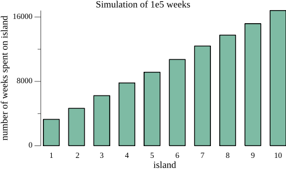

# Markov Chain Monte Carlo (MCMC) Simulation with Metropolis Algorithm

## Introduction

This is an implementation of the MCMC simulation with Metropolis algorithm example from the Statistical Rethinking [1] book (chapter 9.1 page 265) in Go.

King Markov wants to visit every 10 islands of his kingdom regularly.
He wants to visit islands were with a bigger population and therefore with more people who love him more often than smaller islands.
The second island is twice as popular as the first, the third is three times as popular as the first, and so on.
Using MCMC allows the king to visit the islands depending on the popularity without scheduling every trip in advance.

### References

[1] McElreath, R. (2020). Statistical rethinking: A Bayesian course with examples in R and Stan. Chapman and Hall/CRC.

## Run Simulation

`go run ./main.go` creates a `barchart.png` as shown in the result section.

You can change the vars `numWeeks` and `numIslands` to adjust the simulation. But plotting is only possible for 10 islands.

## Results

This is the resulting bar chart after 100000 (1e5) weeks.

## License

Copyright © 2022-2023 Andreas Bauer

This work (source code) is licensed under  [MIT](./LICENSE).

Logo is generated with DALL·E 3.
